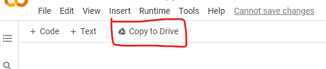

<h1 align="center"> COMP10001 - Foundations of Computing</h1>

## 🔌 Some Plugs

<pre>
Feel a bit drained after a long period of study?🥵😵‍💫📚 We know that you need a break from the stress of uni😈🥸 Come down to PAR-Arts West North Wing-356 on October 7th Friday at 12-2pm to have FREE lunch with WIT!🌯🫔🥢
Ready to hang out with other cute members, chat with new committee and enjoy some delicious Vietnamese food together?🤩💖 We’ll serve pescatarian, vegetarian, vegan and gluten-free options!🤤 Let us know you're coming by simply clicking GOING😍

📢Meanwhile, we'll have our Special General Meeting for these positions:
👩‍🏫Education Director
👩‍💼Industry Liaison Director
👩‍💻Webmaster (IT Director)

If you are unable to attend in person, you are welcome to participate via Zoom: https://unimelb.zoom.us/j/89171169543#success

🗳 Elections will take place during the SGM, and you can nominate yourself or someone else by completing Committee Nomination Form: https://docs.google.com/forms/d/e/1FAIpQLSe6zU0N1ueionUxuTnprprm4f2-Ry-q4c4cJdoC7yKp0q1GNw/viewform

All club members are welcome to nominate themselves or vote!🤗No experience required! Don't forget to sign up if you haven't already✍️ (Free membership): https://umsu.unimelb.edu.au/buddy-up/clubs/clubs-listing/join/7765/

We can't wait to see you there🥰
</pre>

## 🔗 Links Table
|Week|Google Colab|Slides|Topics|
|--|--|--|--|
|Week 3|[Google Colab](https://colab.research.google.com/drive/13o5MSvhiKnr1rM6AlylziduG2JwH-REm?usp=sharing)| [Google Slides (with answers)](https://docs.google.com/presentation/d/11Te6n84zVXe1PVs2dLbz_RnGs-CcOhXTyqQoJuRbAZg/edit?usp=sharing)|Data Types, Variables, Arithmetic Operators|
|Week 4|[Google Colab](https://colab.research.google.com/drive/1hJ70dFYe31nwMU51zYaEIsCwEZNsK87P?usp=sharing)|[Google Slides (with answers)](https://docs.google.com/presentation/d/1jnQJRLVLSBnHdf1Um5RZk6TVpo2ytbahmUDLtRw_08U/edit#slide=id.g14459075c0e_0_106)|Booleans, Relational & Logic Operators, and Conditionals (if Statements); Sequences, Indexing and Slicing; Functions|
|Week 5|[Google Colab](https://colab.research.google.com/drive/14UkPWCcxFWElB1yNRbJ2fgonOrJexYC3?usp=sharing)|[Google Slides (with answers)](https://docs.google.com/presentation/d/1VH5XPKs5t7ikBQ1c0Vqp2mi2WYhS5yHXPIAtqWA6wIM/edit?usp=sharing)|Functions and Methods, Lists and Tuples, Loops|
|Week 6|[Google Colab](https://colab.research.google.com/drive/198RF7ZT8-_eH7QEXCOdXiSZzIWR6D2Ht?usp=sharing)|[Google Slides (with answers)](https://docs.google.com/presentation/d/1vJA24SuyoVh8auylS-xSa7fUK8E-fUlJup3IOp_bmQo/edit?usp=sharing)|Dictionaries, Sets, None|
|Week 7|[Google Colab](https://colab.research.google.com/drive/1XFI-XnF71TmIwFCRB7ya-lNnOr7Nj34l?usp=sharing)|[Google Slides (with answers)](https://docs.google.com/presentation/d/1tkKafIhiIXZnJoDiouZs3fmWFlaGGxUwX05uScg7ES8/edit?usp=sharing)|Code Documentation|
|Week 8|[Google Colab](https://colab.research.google.com/drive/1WVVooHSSaUnrJ_LyoksnnGbtXjA7VfbU?usp=sharing)|[Google Slides (with answers)](https://docs.google.com/presentation/d/1yXhZhMYS-hVZc5td55rpiRARtmeXQjGMFEB7JahGHEo/edit?usp=sharing)|Libraries, Default Dictionaries, Errors|
|Week 9|[Google Colab](https://colab.research.google.com/drive/1GMNwtkIue9z7GPfgYtSXqdVvBCEeirmA?usp=sharing)|[Google Slides (with answers)](https://docs.google.com/presentation/d/1tRioaMXDu6wpnr0d4UZqr4LV40J0GQwC4zk--_VqMBM/edit?usp=sharing)|List Comprehensions, Files|
|Week 10|[Google Colab](https://colab.research.google.com/drive/1K9fycg8mZAF5y5_dWMRlqOiFaEXCnwA8?usp=sharing)|[Google Slides (with answers)](https://docs.google.com/presentation/d/15QXAJaD_ZG5inaB-DeJamBxqhlN_0OVKZD3DfU4RPTU/edit?usp=sharing)|itertools, recursion, Project 2|
|Week 11|Google Colab|Google Slides (with answers)||
|Week 12|Google Colab|Google Slides (with answers)||

* [Cheatsheet](./notes.md)

## ✨ About Tutorials
* Try to come to tutorials regardless of whether or not you've watched lectures
* I basically cloned each week's tute sheet into a Google Colab so yall can fill it up with answers, take down notes and write code all on the same document for easy reference in the future
* the Google Colab link for each week will be in this [GitHub Repo](https://github.com/chuahxinyu/comp10001) by Sunday each week and Slides (with answers) will be uploaded by the end of Wednesday's tutorial (1pm)
* 🙋 be sure to ask questions before/during/after class - my email: chuaxc@unimelb.edu.au

## 🌻 Using Google Colab
> **Note** 
> Google Colab is a useful tool to write notes and code on the same document
> 
> BUT you don't have to use Google Colab if you don't want to - feel free to do the tutorial using paper and pen or 

1. Open the Google Colab link for the week from the Links Table
2. Click on 'Copy to Drive' to write your own answers/notes and save changes
   * 
* **2 Types of Cells**
  * Markdown (Text) Cells
    * double click on cells to edit
    * you can learn more about [Markdown Syntax](https://colab.research.google.com/notebooks/markdown_guide.ipynb)
  * Code Cells
    * use `Ctrl + /` to comment or uncomment lines
    * use `Ctrl + Enter` or click on the run button (top left of the cell) to run the code in the cell
  * Feel free to add your own cells to write notes or experiment with some code!

